# How to Use — Tomodachi Texture Tool

This guide walks you through replacing the texture of a custom item (like a Treasure/Good) with your own image. The process is the same for all item types.

---

## Part 1 — Create a placeholder item in-game

You need to create the item in-game first so the game generates the save files for it.

**1.** Launch Tomodachi Life.

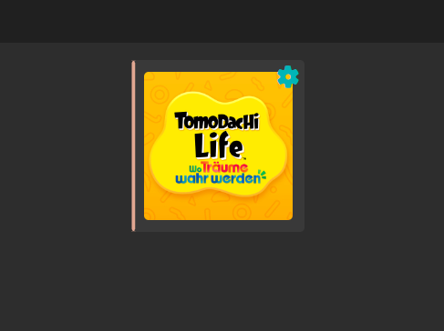

**2.** Go to the **Werkstatt** (Workshop) building on your island.

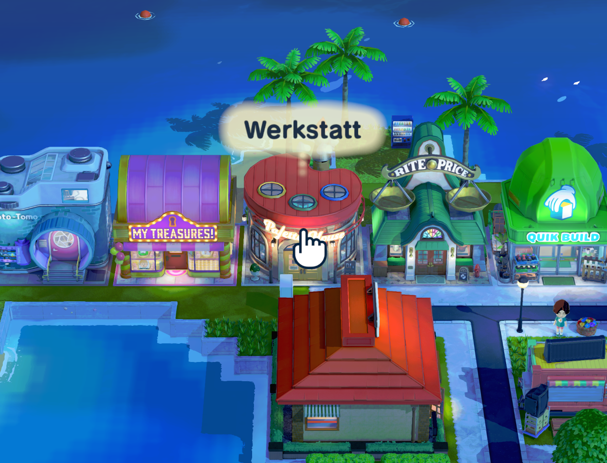

**3.** Select **Neue Kreation** (New Creation).

**4.** Pick the category matching what you want to create. In this example we pick **Schätze** (Treasures / Goods).

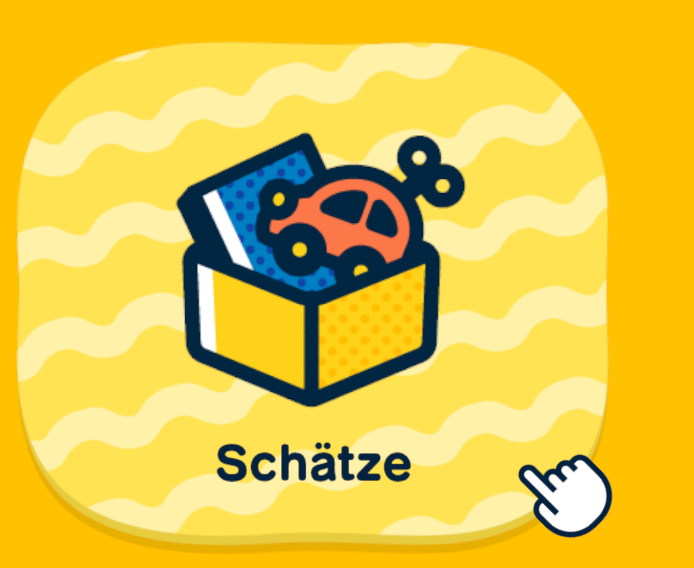

**5.** Choose **Frei gestalten** (Free design) — draw anything as a placeholder, it doesn't matter what.

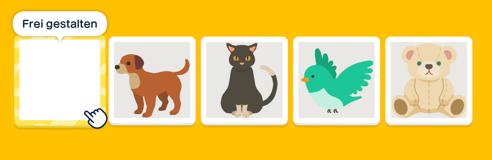

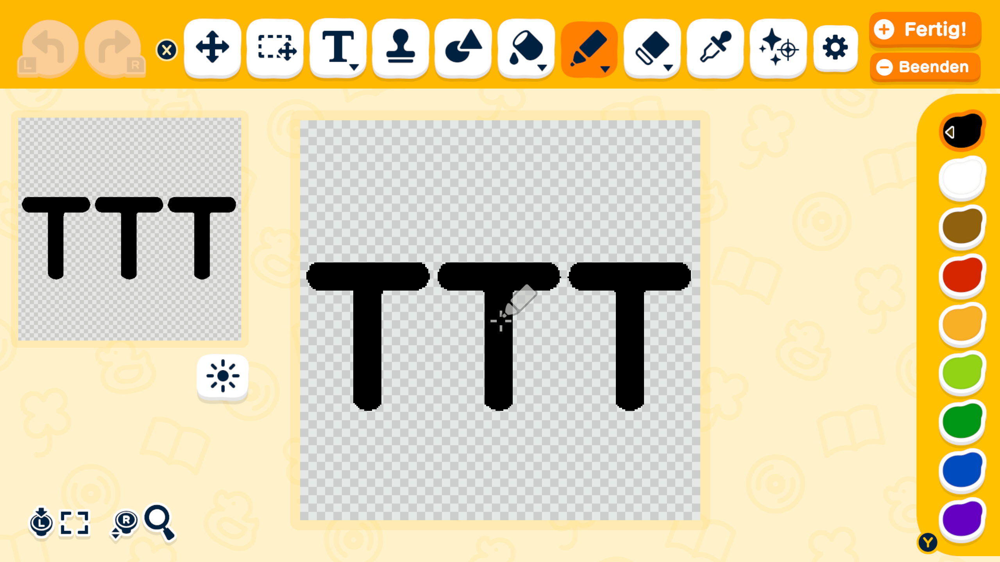

**6.** Give it a name and finish the setup screens (gender, properties, etc.), then confirm.

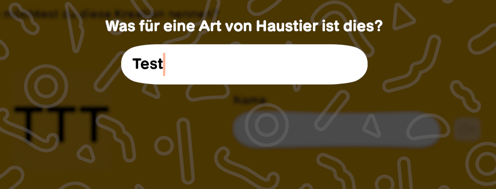

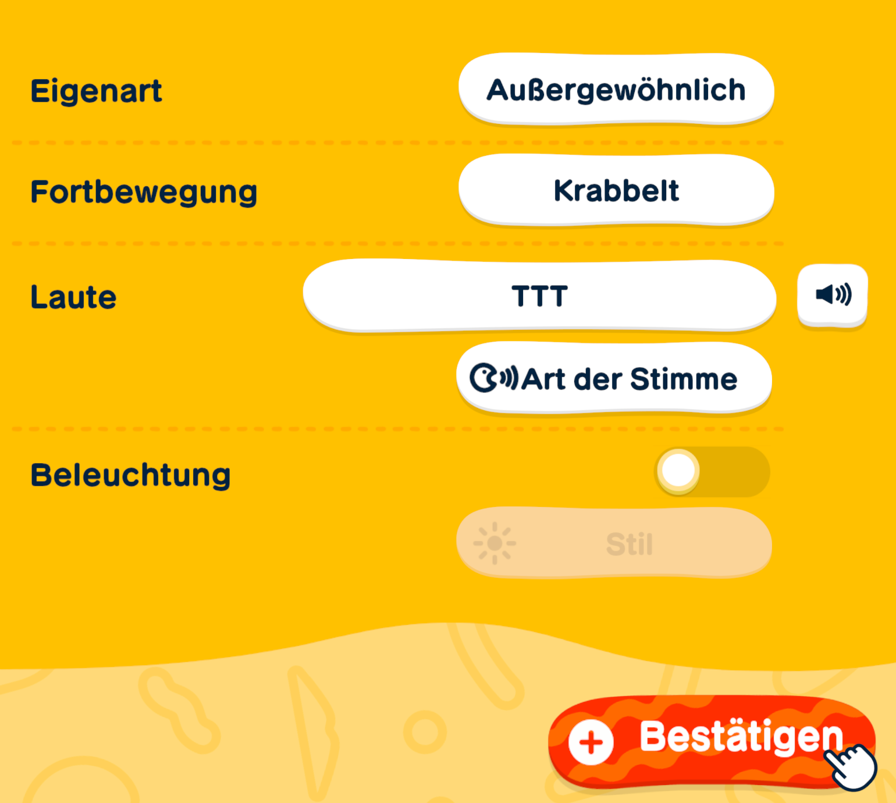

**7.** You'll see the finished item. Now click **Beenden** (Quit) to save and exit the workshop.

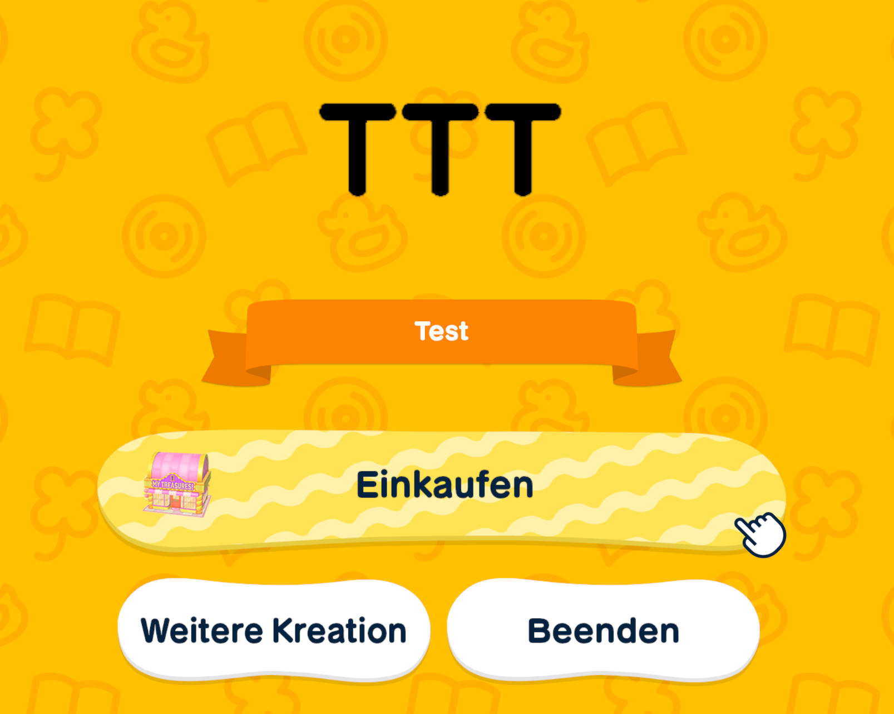

**8.** Save the game and close it.

---

## Part 2 — Find your Ugc save folder

**9.** In Ryujinx, right-click Tomodachi Life and select **Open User Save Directory**.

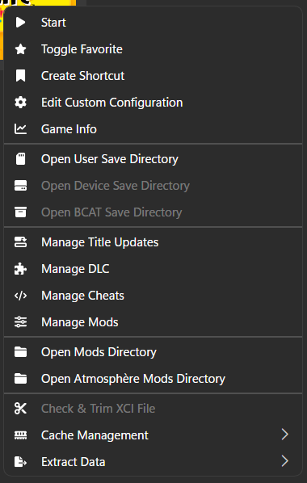

**10.** A folder will open. Navigate into the **Ugc** subfolder — this is where the game stores all custom item files.

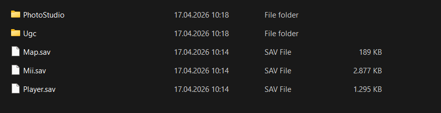

Copy the full path to the **Ugc** folder, you'll need it in the next step.

---

## Part 3 — Convert your image with the tool

**11.** Open **TomodachiTextureTool.exe**.

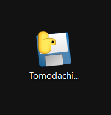

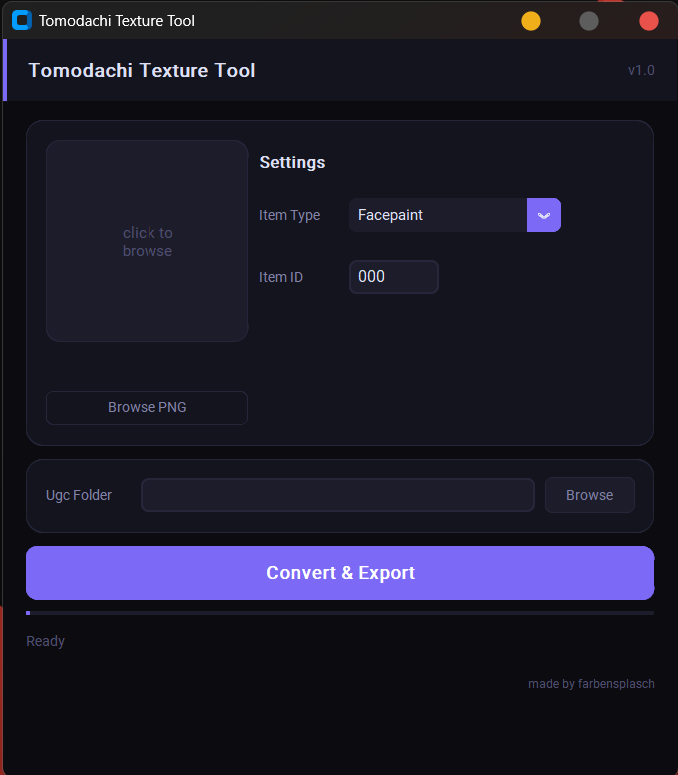

**12.** Click **Browse** next to **Ugc Folder** and select the Ugc folder from the previous step.

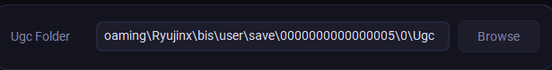

**13.** Set the **Item Type** to match what you created in-game (e.g. **Goods** for Treasures). The tool will show you the **highest** existing ID in your folder — this is the item you just created.

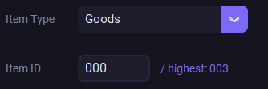

**14.** Set the **Item ID** to the highest number shown.

**15.** Click the image box or **Browse PNG** and select your image file.

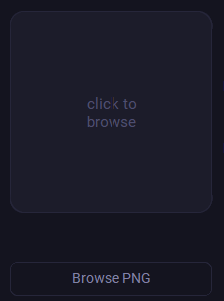

**16.** Your image will appear as a preview. Double-check the Item Type and Item ID are correct.

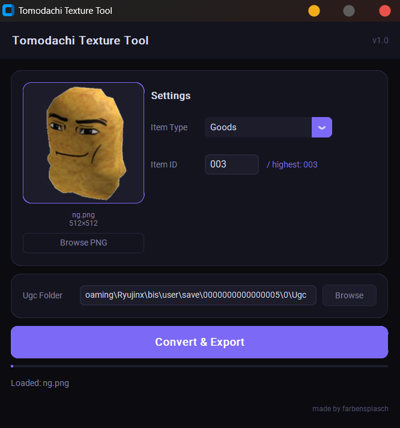

**17.** Click **Convert & Export**. When it's done you'll see a green confirmation message with the two filenames that were written.

---

## Part 4 — Apply the texture in-game

**18.** Launch Tomodachi Life again.

**19.** Go to **Werkstatt → Kreationen** (Creations).

**20.** Find your item in the list and select it.

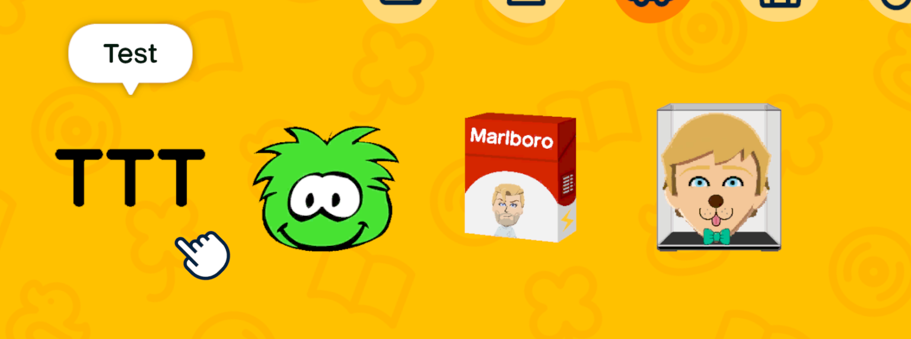

**21.** Click **Design ändern** (Change design).

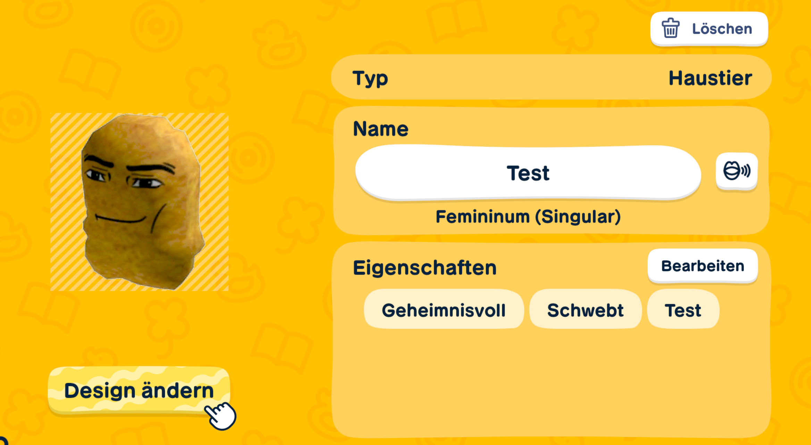

**22.** You'll see your custom image loaded in the drawing editor. Press **Fertig** (Done / +) to confirm without changing anything.

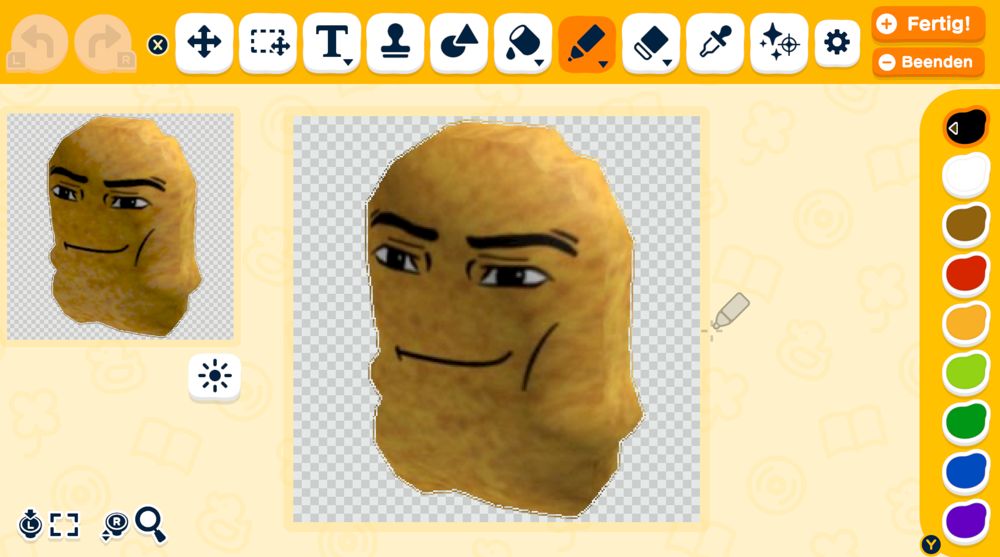

**23.** Your item now has the custom texture applied and is visible in-game!

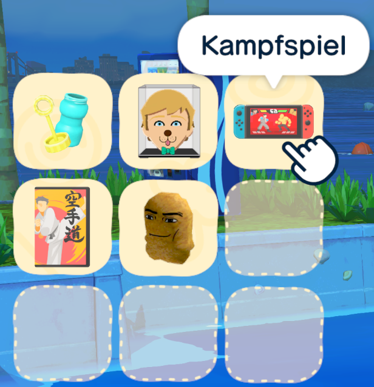

---

## Notes

- The image will be resized to fit while keeping its aspect ratio.
- Transparency works, but only fully transparent or fully opaque pixels — partial transparency (e.g. 50% opacity) will look wrong.
- The same process works for every item type (Clothes, Exterior, Food, etc.) — just select the matching Item Type in the tool.
